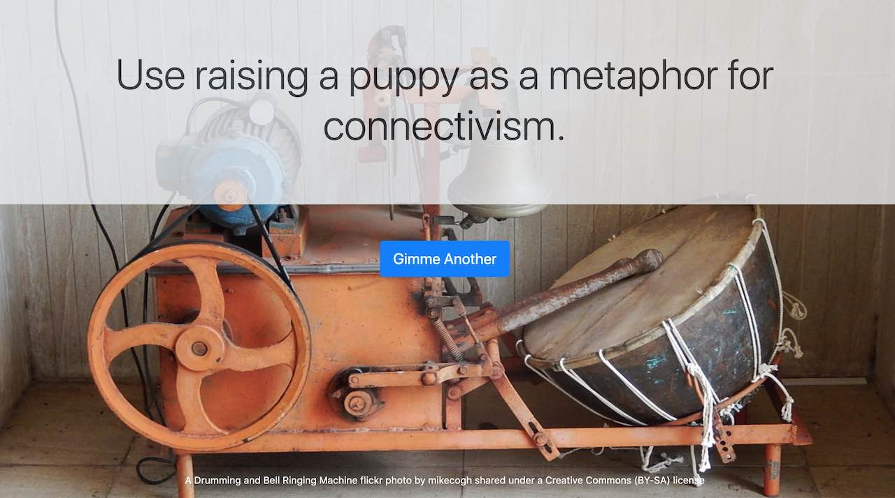

# EdTech Metaphor Generator

[A Mashup generator originally made for Martin Weller](http://blog.edtechie.net/edtech/ed-tech-metaphor-generator/). Check it out! It's a practical stick. eh?

https://cogdog.github.io/edtechaphors/

What I like about this random generator is that it allows you to create text generators that do not follow a single sentence pattern but it provides a mix and match way to pull from different sets of possible fill in words, but also, randomize the formula for sentences that use them.

If that is as clear as mud, try the examples below.

Learn more about this little experiment in [A Generator for Martin](https://cogdogblog.com/2019/09/generator-for-martin/)

And it's even more fun to make then to use! As a service, [this gnarly looking page can be viewed more cleanly with Docsify This](https://docsify-this.net/?basePath=https://raw.githubusercontent.com/cogdog/edtechaphors/master&homepage=README.md&sidebar=true#/).

## My Fleet of Generators
There are more as part of this repo or as Alan feels like rolling out new ones. You can actually **contribute** to them by forking a copy (or just going to the index.html in any and click the edit button, this will generate a copy). Push the changes my way, please, make my day! Your additions will make these generators more interesting!

* Original (Extra Crispy?) EdTech Metaphors https://cogdog.github.io/edtechaphors/
* A Generator Generator (Alan goes meta) https://cogdog.github.io/edtechaphors/meta
* Creative Prompt Machine https://cogdog.github.io/edtechaphors/create
* Remix It Up in the H5P Kitchen https://cogdog.github.io/edtechaphors/h5p
* Ridiculous Word Analogies https://cogdog.github.io/edtechaphors/analogies
* A new version of Martin's Edrech Metaphors in case he ever decides to update (more random fun, button names, tweet button) https://cogdog.github.io/edtechaphors/martin 
* English Lit Dissertations of the Pandemic Era https://cogdog.github.io/edtechaphors/pandemiclitdiss/
* Everyone is Rolling out an AI Named Q https://cogdog.github.io/edtechaphors/q/

See also [how the Creative Prompt machine was used as a DS106 Daily Create](https://daily.ds106.us/tdc3581/).

## Make Your Own, aka Fork and Roll

Make your own! Change out the background image and modify the structure of generated phrases. Here are ones I know that others have done

* Open Education Metaphors by Martin Weller (featuring Teilo with a big stick!) http://metaphor.edtechie.net/ and [now an entire BOOK](http://blog.edtechie.net/books/metaphors-of-ed-tech-is-out/) that even features this tool
* Modified version by John Johnston (pulling the content from a google sheet, that's neat!) http://git.johnj.info/edtechaphors/?id=1Tk-IUE8OG_InI6KjZ4GAFMm4IyJl1PoZQYzHCbm4fN8
* EdTech Metaphor Generator auf deutsch übersetzt/ angepasst by Nele Hirsch https://metaphernbot.glitch.me/
* Open Degree Metaphors by Martin Weller http://opendegree.edtechie.net/
* EdTech Pitch Machine by (again) Martin Weller https://edtechie.net/edtechpitch/

You can easily download this repo make your own copy, and hoist to your own web server or any place you can publish HTML to the web. That's your own generator, which is nice.

## Hardly Passing For Documentation

You will need a bit of HTML knowledge to change the title, initial prompt, and adjust credits for the background image. All of the generating magic is done in JavaScript. Create arrays for all sets of phrases you want to have mixed up, this is the setup for the [original EdTech Metaphors one](https://cogdog.github.io/edtechaphors/)

       // array of metaphors- 
	  let metaphor = [
	      'baking a cake', 'a houseplant', 'running a marathon', 'raising a puppy', 
	      'quantum physics', 'visiting an unknown country',
	      'the history of porcelain manufacture',
	      'the development of New York graffiti styles','the Corn Laws',
	      'the Loch Ness monster myth','the CB radio craze of the 70s',
	      'the Gargoyles of the Notre Dame','an all you can eat “Around the world” buffet',
	      'the growth of interest in vinyl records','a comfortable old coat',
	      'knitting','Homers The Iliad','gardening','the ecosystem of a small island',
	      'your favourite film','the structure of a typical horror film', 
	      'chasing a cat', 'finding a big stick', 'a local castle', 'real hockey'
	    ];
  
  	  // array of technologies
	  let tech = [
	      'learning analytics', 'VLE', 'blockchain', 'OER', 'MOOCs', 
	      'personalised learning','Artificial Intelligence','open textbooks',
	      'automated assessment','MCQs','digital natives','connectivism',
	      'blogging','plagiarism detection sites','lecture capture',
	      'Flipped Learning','Facebook','academics use of Twitter',
	      'open access publishing','mobile learning','learning styles',
	      'LMS','e-portfolios','Wikipedia','student-generated content'
	];

You can rename these and make up new ones. That is one level or randomization, think of these as placeholders that can be mixed up.

The second level of randomness is done by creating a set of different sentences that will make sense using a random element from any of the arrays. This set needs to be enclosed in back tick characters for the variable to work -- `${metaphor[random(metaphor)]}` will provide a random metaphor from the first array above.

      	 let options = [
	  	   `Use ${metaphor[random(metaphor)]} as a metaphor for ${tech[random(tech)]}.`, 
		   `How is ${metaphor[random(metaphor)]} an analogy for ${tech[random(tech)]}?`, 
		   `What does ${metaphor[random(metaphor)]} tell us about ${tech[random(tech)]}?`,
		];
The more of these you make, the more random your generator becomes (3 is a minimum, 5 or more is better, 10 is just wildly fantastic).

And more random fun, you can also randomize the labels of the remix button:

        /* Fun random names for the buttons, edit or add more */
		 let button_names = [
			'Make Me Another',
			'More Metaphors, please!',
			'Metaphor it Again',
			'Gimme More',
			'Crank it Again',
		];

And you can customize as well the magic that generates a tweeted version of a mix, including a name to mention, and a name for the thing being metaphor-

     // add the teet this button, change the tweeted name as needed (if you must)
  	 // and provide the name for the kind of thing generated
  	 tweet_it_like_a_bluebird( generated, '@cogdog', 'EdTech Metaphor');

Recommended attribution: 

> "<#title#>" by Creative Commons is licensed under CC BY 4.0. Available at    
> https://github.com/creativecommons/cc-cert-edu/blob/master/contents/<#unit#>/README.md

## As if Versioning Happens by Magic

* Oct 26, 2021: Updated Bootstrap, jQuery, Backstretch.js versions, tweet code extracts URL from HTML href links in a generated message, re-organized code and fitted with more descriptive comments, created 2 more demos
* Oct 19, 2021: Just for fun (and to test that links work) made a generator that generates generators
* Jan 27, 2021: Added randomized button names, and a tweet this button
* Sep 25, 2019: First version started up

